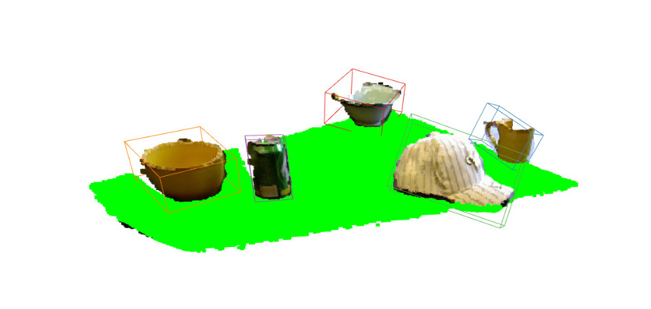

# SAVI - Trabalho Prático 2

O objetivo deste trabalho é que o sistema desenvolvido seja capaz de detetar os objetos presentes numa cena e obter as suas propriedades. 
Para isso são utilizados os dados do Washington RGB-D Dataset, onde existem dois datasets distintos, o RGB-D Object Dataset e o RGB-D Scenes Dataset. 
O RGB-D Object Dataset contém vários objetos de diferentes categorias. Neste dataset os objetos são visualizados isoladamente. 
Além disso, o dataset contém informações acercas dos objetos tais como: os labels (ground truth), a pose do objeto, a sua localização nas imagens RGB, Depth e na point cloud. O RGB-D Scenes Dataset contém 14 cenas com mobília (sofás e mesas) e objetos que estão presentes no RGB-D Object Dataset. 
Este dataset tem também anotações dos objetos na cena.

### Objetivo 1 - Treino de um classificador em deep learning
1.1 - Desenvolver uma rede de deep learning que consiga efetuar a classificação dos objetos, com a divisão do RGB-D Object Dataset em treino e teste (80% / 20%). 

1.2 - Depois de treinada, calcular a precisão global e por classe.

### Objetivo 2 - Pre-processamento 3D
2.1 - Desenvolver um sistema que processe a nuvem de pontos de uma cena (dados do RGB-D Scenes Dataset) e que consiga isolar os objetos presentes nessa nuvem. 

2.2 - Calcular as várias propriedades dos objetos como: a cor, a altura, a largura e outras propriedades relevantes.

### Objetivo 3 - Classificação de objetos na cena
3.1 - Através do ponto anterior, extrair uma sub-imagem que contenha apenas o objeto.

3.2 - Dar a imagem extraída à rede de classificação anteriormente desenvolvida. (Outra solução será treinar uma rede de classificação que utilize informação tridimensional para o reconhecimento de objetos.)

### Objetivo 4 - Descrição áudio da cena
Utilizar um sintetizador de discurso para que o sistema consiga descrever verbalmente a cena que lhe é mostrada, dizendo por exemplo: 

"A cena contém duas canecas, uma branca e outra azul, e uma caixa de cereais vermelha com altura de 15 centímetros."

### Objetivo 5 - Métricas de performance
Apresentar métricas de performance. Em particular, para os detetores de objetos devem ser apresentadas métricas de Precision, Recall e F1 Score. 

### Objetivo 6 - Sistema em tempo real
Experimentar o sistema a correr em tempo real com uma camara RGB-D em frente de uma mesa com objetos.
